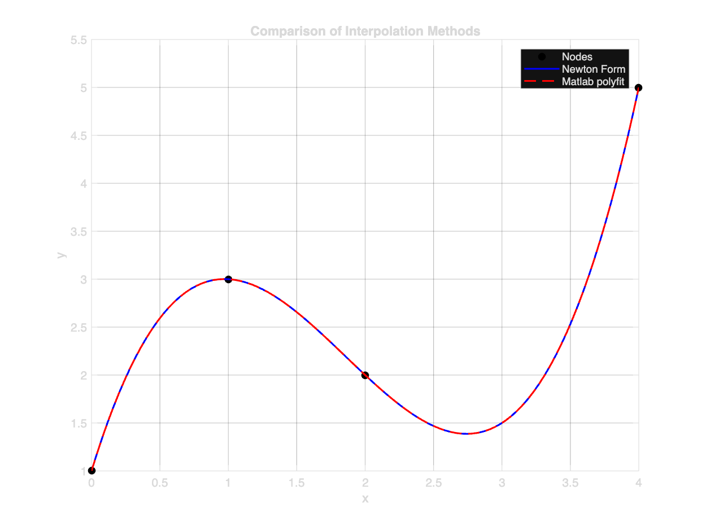
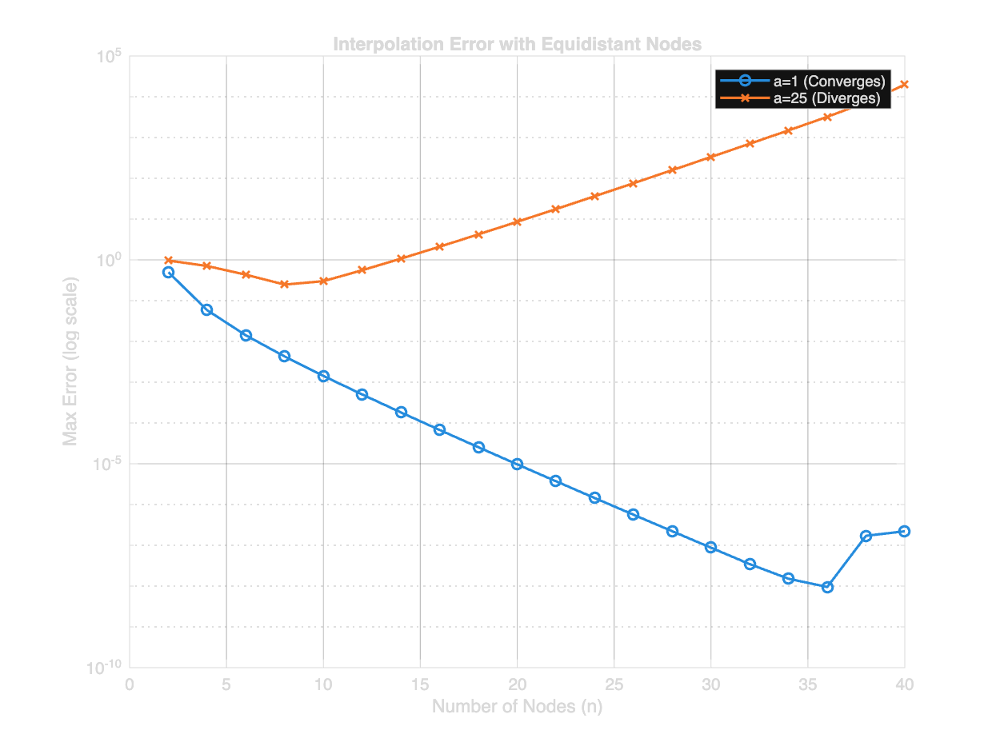
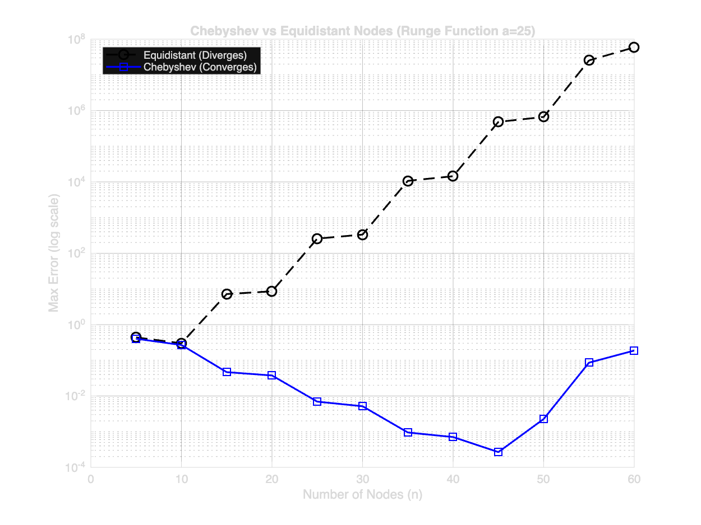
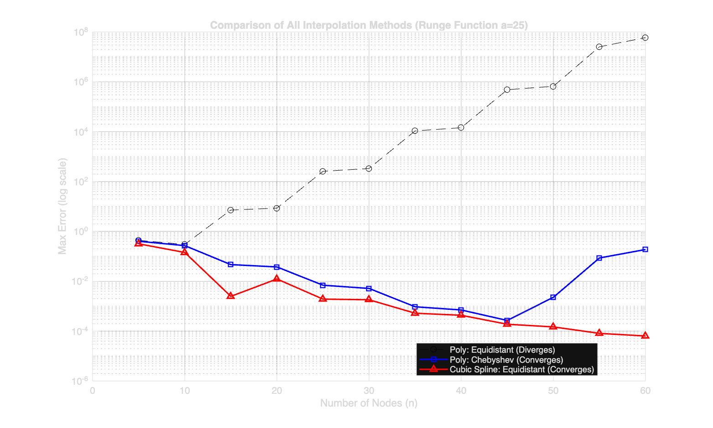
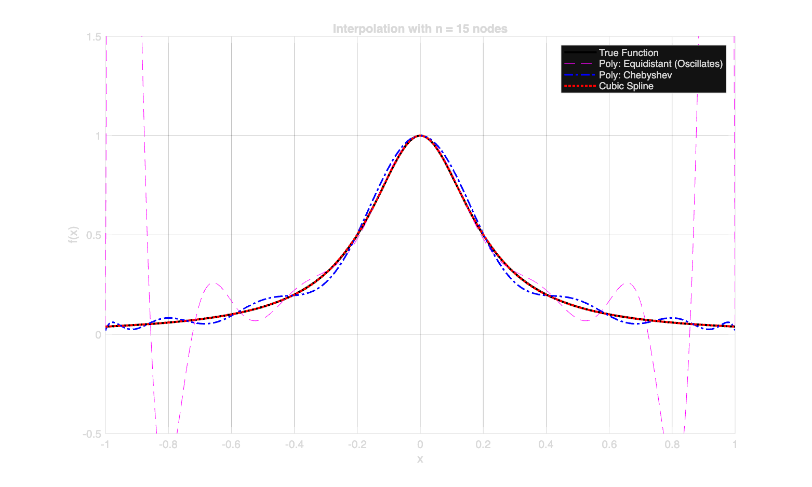

```{r setup, include=FALSE}
knitr::opts_chunk$set(echo = TRUE, warning = FALSE, message = FALSE)
```

```{r run-matlab, include=FALSE, eval=FALSE}
# This chunk can be used to run MATLAB code from R
# Requires: MATLAB installed and matlab R package
# Uncomment and set eval=TRUE if you want to run MATLAB from R

# library(matlab)
# matlab_path <- "/Applications/MATLAB_R2023b.app/bin/matlab"  # Adjust path
# 
# # Run MATLAB script
# runMatlabScript("matlab/HW02_Solution.m", matlab_path)
```

## Question 1 Spline Interpolation

**1(a) Quadratic Spline ($k=2$)**

**Form of the Spline:**
Let the nodes be $x_0, x_1, \dots, x_n$ defining $n$ sub-intervals. On the $i$-th interval $[x_i, x_{i+1}]$ (for $i=0, \dots, n-1$), the quadratic spline $S_2(x)$ is a polynomial $P_i(x)$ of degree 2. By lecture note 3, we can write the local representation as:

$$P_i(x) = a_i + b_i(x - x_i) + c_i(x - x_i)^2$$

There are 3 coefficients ($a_i, b_i, c_i$) for each of the $n$ intervals. so total unknowns = $3n$.

**Continuity and Interpolation Conditions:**
To determine these coefficients, we impose the following conditions:

1.  **Interpolation (Connectivity):** The spline must pass through the given data points $(x_i, y_i)$. Each polynomial segment must match the function values at its endpoints:

    * $P_i(x_i) = y_i$ (for $i=0, \dots, n-1$) $\implies n$ conditions.

    * $P_i(x_{i+1}) = y_{i+1}$ (for $i=0, \dots, n-1$) $\implies n$ conditions.

    * Total Interpolation Conditions: $2n$.

2.  **Smoothness (Derivatives):** We define a spline of degree $k$ to be in $C^{k-1}[a, b]$. For a quadratic spline ($k=2$), we seek continuity of the first derivative*($C^1$) at the interior nodes $x_1, \dots, x_{n-1}$.

    * $P'_i(x_{i+1}) = P'_{i+1}(x_{i+1})$ (for $i=0, \dots, n-2$).

    * Total Derivative Conditions: $n-1$.

Therefore, total equations required for $C^1$ continuity: $2n \text{ (interpolation)} + (n-1) \text{ (smoothness)} = 3n - 1$.

* Total Unknowns: $3n$.

* Extra Conditions Needed: $3n - (3n - 1) = 1$.

<!-- **Answers:**
* **Continuity:** It can have **one** continuous derivative ($C^1$). (Imposing $C^2$ would require $n-1$ additional equations, leading to $4n-2$ constraints, which exceeds the $3n$ unknowns).
* **Extra Conditions:** **1** extra condition needs to be added (e.g., specifying the derivative at the starting node $y'_0$). -->

**1(b) Generalization to splines using polynomials of degree $k$**

Let $S_k(x)$ be a spline of degree $k$ on $n$ intervals.
Each polynomial piece has $k+1$ coefficients.
$$\text{Total Unknowns} = n(k+1) = nk + n$$

**Conditions:**

1.  **Interpolation:** The curve must pass through the endpoints of each interval. so Total Interpolation Conditions: $2n$.

2.  **Smoothness:** We require continuity of derivatives up to order $k-1$ (i.e., $S_k \in C^{k-1}$) at the $n-1$ interior nodes. So Total Derivative Conditions $= (k-1) \times (n-1)$

$$
\begin{aligned}
\text{Total Equations} &= 2n + (k-1)(n-1) \\
&= 2n + (kn - k - n + 1) \\
&= kn + n - k + 1
\end{aligned}
$$

$$
\begin{aligned}
\text{Extra Conditions} &= \text{Unknowns} - \text{Total Equations} \\
&= (nk + n) - (kn + n - k + 1) \\
&= k - 1
\end{aligned}
$$

Therefore, for a spline of degree $k$, we need to add **$k-1$** extra conditions to uniquely determine the spline.

---

## Question 2: Newton Form Implementation

## Q2(a): Implementing `newt_polyval`

The function `newt_polyval` evaluates the Newton form polynomial:

$$p(x) = \sum_{i=0}^{n-1} c_i \prod_{j=0}^{i-1} (x - x_j)$$

```{matlab, eval=FALSE, echo=TRUE}
function pvals = newt_polyval(nodes, coeffs, xvals)
% NEWT_POLYVAL Evaluate Newton form polynomial
%   Evaluates: p(x) = c_0 + c_1(x-x_0) + c_2(x-x_0)(x-x_1) + ...
%
%   Inputs:
%     nodes: vector of interpolation nodes [x_0, x_1, ..., x_{n-1}]
%     coeffs: vector of Newton coefficients [c_0, c_1, ..., c_{n-1}]
%     xvals: vector of points at which to evaluate the polynomial
%   Output:
%     pvals: values of the polynomial at xvals

    n = length(coeffs);
    pvals = zeros(size(xvals));
    
    for idx = 1:length(xvals)
        x = xvals(idx);
        p = coeffs(1);  % Start with c_0
        
        % Evaluate: p(x) = c_0 + c_1(x-x_0) + c_2(x-x_0)(x-x_1) + ...
        product = 1;
        for i = 2:n
            product = product * (x - nodes(i-1));  % (x-x_0)...(x-x_{i-2})
            p = p + coeffs(i) * product;
        end
        pvals(idx) = p;
    end
end
```

## Q2(b): Comparison with `polyfit`

We use the divided difference function `dividif` (from textbook page 342) to compute Newton coefficients and compare with MATLAB's `polyfit`.

```{matlab, eval=FALSE, echo=TRUE}
%% dividif (From Textbook Page 342)
function [d] = dividif(x, y)
    % DIVIDIF Newton divided differences
    % Computes the divided difference table.
    % x: interpolation nodes
    % y: function values
    
    [n_rows, m_cols] = size(y);
    if n_rows == 1
        n = m_cols;
    else
        n = n_rows;
    end
    
    n = n - 1; % Degree is length - 1
    d = zeros(n+1, n+1);
    
    % Initialize first column with y values
    % Note: Transposing y if it's a row vector to fit the column
    d(:, 1) = y(:); 
    
    for j = 2 : n+1       % Column loop (Order of difference + 1)
        for i = j : n+1   % Row loop
            % Recursive formula for divided differences
            numerator = d(i-1, j-1) - d(i, j-1);
            denominator = x(i-j+1) - x(i);
            d(i, j) = numerator / denominator;
        end
    end
end
```

**Test Case:** Interpolation with nodes $[0, 1, 2, 4]$ and function values $[1, 3, 2, 5]$

```{matlab, eval=FALSE, echo=TRUE}
x_nodes = [0, 1, 2, 4];          % Nodes (x_0, x_1, ...)
y_vals = [1, 3, 2, 5];           % Function values (y_0, y_1, ...)

% compute Newton Coefficients using 'dividif'
d_table = dividif(x_nodes, y_vals);
difference table
n = length(x_nodes);
coeffs = diag(d_table)'; 

x_test = linspace(min(x_nodes), max(x_nodes), 100);

% Evaluate using our Newton form
y_newton = newt_polyval(x_nodes, coeffs, x_test);
% Evaluate using Matlab's Built-in 'polyfit'
p_standard = polyfit(x_nodes, y_vals, n-1); 
y_polyfit = polyval(p_standard, x_test);

max_error = max(abs(y_newton - y_polyfit));

fprintf('Number of nodes: %d\n', n); 
fprintf('Maximum difference between newt_polyval and polyfit: %e\n', max_error);
```

**Results:**

- The `dividif` function computes the full divided difference table

- Newton coefficients are extracted from the main diagonal: $c_i = d_{i+1,i+1}$ for $i = 0, \ldots, n-1$

- Both `newt_polyval` and `polyfit` produce identical interpolating polynomials (within machine precision). From matlab output: Maximum difference between newt_polyval and polyfit: 1.065814e-14. 

**Key Observations:**

- The divided difference table stores all intermediate computations

- The diagonal elements $d_{i+1,i+1}$ correspond to the Newton coefficients $f[x_0, \ldots, x_i]$

- Since the interpolating polynomial is unique, both methods must produce the same result

```{r, fig.cap="Q2: Newton Form vs polyfit Comparison", out.width="80%", fig.align='center'}

```

---

# Question 3: Chebyshev Nodes 

## Q3(a): Testing $f(x) = \frac{1}{1 + a x^2}$ with Equally Spaced Nodes

We test two cases:

- **Case 1:** $a = 1$ (should converge)

- **Case 2:** $a = 25$ (should diverge - Runge phenomenon)

```{matlab, eval=FALSE, echo=TRUE}
% Define the Runge function handle
runge_f = @(x, a) 1 ./ (1 + a * x.^2);

% Define the range for evaluation
x_fine = linspace(-1, 1, 1000);

%% Part (a): Equally Spaced Nodes Compare a=1 vs a=25

N_values = 2:2:40; % Number of nodes to test
error_a1 = zeros(size(N_values));
error_a25 = zeros(size(N_values));

for k = 1:length(N_values)
    n = N_values(k);
    
    % Generate equidistant nodes
    x_nodes = linspace(-1, 1, n);
    
    % Case 1: a = 1
    y_nodes_1 = runge_f(x_nodes, 1);
    p_1 = polyfit(x_nodes, y_nodes_1, n-1);
    y_interp_1 = polyval(p_1, x_fine);
    y_true_1 = runge_f(x_fine, 1);
    error_a1(k) = max(abs(y_interp_1 - y_true_1));
    
    % Case 2: a = 25
    y_nodes_25 = runge_f(x_nodes, 25);
    p_25 = polyfit(x_nodes, y_nodes_25, n-1);
    y_interp_25 = polyval(p_25, x_fine);
    y_true_25 = runge_f(x_fine, 25);
    error_a25(k) = max(abs(y_interp_25 - y_true_25));
end

% Plotting results for Part (a)
figure('Name', 'Part (a): Convergence vs Divergence');
semilogy(N_values, error_a1, '-o', 'LineWidth', 1.5, 'DisplayName', 'a=1 (Converges)');
hold on;
semilogy(N_values, error_a25, '-x', 'LineWidth', 1.5, 'DisplayName', 'a=25 (Diverges)');
xlabel('Number of Nodes (n)');
ylabel('Max Error (log scale)');
title('Interpolation Error with Equidistant Nodes');
legend;
grid on;
```

**Observations:**

- **Case $a=1$:** Error decreases as $n$ increases (convergence)

- **Case $a=25$:** Error increases exponentially as $n$ increases (divergence - Runge phenomenon)

<!-- The Runge phenomenon occurs because high-degree polynomials with equally spaced nodes oscillate wildly near the endpoints, especially for functions with poles near the interval. -->

```{r, fig.cap="Q3(a): Runge Phenomenon with Equally Spaced Nodes", out.width="80%", fig.align='center'}

```

## Q3(b): Equally Spaced vs Chebyshev Nodes

We compare interpolation using equally spaced nodes versus Chebyshev nodes for the Runge function:

$$f(x) = \frac{1}{1 + 25x^2}, \quad x \in [-1, 1]$$

**Chebyshev nodes formula:**
$$x_i = \cos\left(\frac{\pi(2i+1)}{2n}\right), \quad \text{for } i = 0, \ldots, n-1$$

**Numerical Comparison Code:**

```{matlab, eval=FALSE, echo=TRUE}
%% Part (b): Chebyshev vs. Equidistant (a=25)
N_values_b = 5:5:60; % Test range
err_equi = zeros(size(N_values_b));
err_cheb = zeros(size(N_values_b));

for k = 1:length(N_values_b)
    n = N_values_b(k);
    
    % Equidistant Polynomial
    x_eq = linspace(-1, 1, n);
    y_eq = runge_f(x_eq, 25);
    [p_eq, ~, mu] = polyfit(x_eq, y_eq, n-1); 
    y_eval_eq = polyval(p_eq, x_fine, [], mu);
    err_equi(k) = max(abs(y_eval_eq - runge_f(x_fine, 25)));
    
    % Chebyshev Polynomial
    i_idx = 0:n-1;
    x_cheb = cos( pi * (2*i_idx + 1) / (2*n) );
    y_cheb = runge_f(x_cheb, 25);
    [p_cheb, ~, mu_c] = polyfit(x_cheb, y_cheb, n-1);
    y_eval_cheb = polyval(p_cheb, x_fine, [], mu_c);
    err_cheb(k) = max(abs(y_eval_cheb - runge_f(x_fine, 25)));
end

% Print numerical comparison
fprintf('Part (b): Numerical Comparison (a=25)\n');
fprintf('n\t\tEquidistant\t\tChebyshev\n');
for k = 1:length(N_values_b)
    fprintf('%d\t\t%.2e\t\t%.2e\n', N_values_b(k), err_equi(k), err_cheb(k));
end

% Plotting Comparison for Part (b)
figure('Name', 'Part (b): Chebyshev vs Equidistant');
semilogy(N_values_b, err_equi, 'k--o', 'LineWidth', 1.5, 'MarkerSize', 8, 'DisplayName', 'Equidistant (Diverges)');
hold on;
semilogy(N_values_b, err_cheb, 'b-s', 'LineWidth', 1.5, 'MarkerSize', 8, 'DisplayName', 'Chebyshev (Converges)');
xlabel('Number of Nodes (n)');
ylabel('Max Error (log scale)');
title('Chebyshev vs Equidistant Nodes (Runge Function a=25)');
legend('Location', 'best');
grid on;
```

**Observations:**

- **Equally spaced nodes:** Error grows exponentially (Runge phenomenon), with the error increases dramatically as $n$ increases beyond 15

- **Chebyshev nodes:** Error decreases as $n$ increases with the error remains small and decreases steadily

- **Why Chebyshev works:** The nodes cluster near the endpoints, minimizing the maximum value of the nodal polynomial $w_{n+1}(x) = \prod_{i=0}^n (x - x_i)$, which appears in the error bound

- The numerical data shows that at $n=15$, equidistant nodes already show severe divergence (error $7.19 \times 10^{0}$), while Chebyshev maintains good accuracy ($4.66 \times 10^{-2}$). As $n$ increases further, the gap widens dramatically.

```{r, fig.cap="Q3(b): Chebyshev vs Equidistant Nodes - Error Comparison Across Different n Values", out.width="80%", fig.align='center'}

```

## Q3(c): Cubic Spline Interpolation Comparison

We compare cubic spline interpolation with polynomial interpolation methods (both equidistant and Chebyshev) for a specific number of nodes. This demonstrates that cubic splines provide an alternative robust approach to avoid Runge phenomenon.

**Numerical Comparison Code:**

```{matlab, eval=FALSE, echo=TRUE}
%% Part (c): Cubic Spline vs Polynomial Methods (Example with n=15)
n_demo = 15;
x_nodes = linspace(-1, 1, n_demo);
y_nodes = runge_f(x_nodes, 25);

% Equidistant Polynomial
p_demo = polyfit(x_nodes, y_nodes, n_demo-1);
y_poly_demo = polyval(p_demo, x_fine);

% Chebyshev Polynomial
i_idx = 0:n_demo-1;
x_c_nodes = cos(pi*(2*i_idx+1)/(2*n_demo));
y_c_nodes = runge_f(x_c_nodes, 25);
p_c_demo = polyfit(x_c_nodes, y_c_nodes, n_demo-1);
y_cheb_demo = polyval(p_c_demo, x_fine);

% Cubic Spline
y_spline_demo = spline(x_nodes, y_nodes, x_fine);

% Compute errors
y_true = runge_f(x_fine, 25);
err_poly_demo = max(abs(y_poly_demo - y_true));
err_cheb_demo = max(abs(y_cheb_demo - y_true));
err_spline_demo = max(abs(y_spline_demo - y_true));

fprintf('Method\t\t\tMax Error\n');
fprintf('Equidistant Polynomial\t%.2e\n', err_poly_demo);
fprintf('Chebyshev Polynomial\t%.2e\n', err_cheb_demo);
fprintf('Cubic Spline\t\t%.2e\n', err_spline_demo);
fprintf('\nImprovement over Equidistant:\n');
fprintf('Chebyshev:\t\t%.2e times better\n', err_poly_demo / err_cheb_demo);
fprintf('Cubic Spline:\t\t%.2e times better\n', err_poly_demo / err_spline_demo);
```

**Numerical Results (n=15):**

\begin{table}[h]
\centering
\begin{tabular}{l|c}
\hline
\textbf{Method} & \textbf{Max Error} \\
\hline
Equidistant Polynomial & $7.19 \times 10^{0}$ \\
Chebyshev Polynomial & $4.66 \times 10^{-2}$ \\
Cubic Spline & $2.48 \times 10^{-3}$ \\
\hline
\end{tabular}
\caption{Maximum interpolation errors for different methods at $n=15$ nodes}
\end{table}

\begin{table}[h]
\centering
\begin{tabular}{l|c}
\hline
\textbf{Method} & \textbf{Improvement Factor} \\
\hline
Chebyshev vs Equidistant & $1.54 \times 10^{2}$ \\
Cubic Spline vs Equidistant & $2.90 \times 10^{3}$ \\
\hline
\end{tabular}
\caption{Improvement factors over equidistant polynomial interpolation}
\end{table}

**Visualization Code:**

```{matlab, eval=FALSE, echo=TRUE}
figure('Name', 'Visualizing Runge Phenomenon');
plot(x_fine, runge_f(x_fine, 25), 'k-', 'LineWidth', 2, 'DisplayName', 'True Function');
hold on;
plot(x_fine, y_poly_demo, 'm--', 'DisplayName', 'Poly: Equidistant (Oscillates)');
plot(x_fine, y_cheb_demo, 'b-.', 'LineWidth', 1.5, 'DisplayName', 'Poly: Chebyshev');
plot(x_fine, y_spline_demo, 'r:', 'LineWidth', 2, 'DisplayName', 'Cubic Spline');
ylim([-0.5, 1.5]); 
title(['Interpolation with n = ' num2str(n_demo) ' nodes']);
legend;
grid on;
```

**Observations:**

- **Equidistant polynomial:** Shows severe oscillations near the endpoints (Runge phenomenon) with error $7.19 \times 10^{0}$

- **Chebyshev polynomial:** Follows the true function closely without oscillations, achieving $154\times$ improvement over equidistant

- **Cubic spline:** Provides smooth approximation without oscillations, achieving $2900\times$ improvement over equidistant

- **Cubic spline** avoids Runge phenomenon by using piecewise low-degree polynomials, making it the most robust method


**Error Comparison Plot Across Different n Values:**

This plot shows how all three methods compare as the number of nodes increases, clearly demonstrating the divergence of equidistant polynomial interpolation and the convergence of both Chebyshev and cubic spline methods.

```{r, fig.cap="Q3(c): All Methods Comparison - Error vs Number of Nodes", out.width="80%", fig.align='center'}

```

**Visualization at n=15:**

This plot shows the actual function approximations, demonstrating the severe oscillations in equidistant polynomial interpolation and the smooth approximations provided by Chebyshev and cubic spline methods.

```{r, fig.cap="Q3(c): Visualization of Interpolation Methods at n=15", out.width="80%", fig.align='center'}

```

---

# Appendix: Complete MATLAB Functions

The complete MATLAB functions are available in the `matlab/` directory:

- `newt_polyval.m`: Newton form evaluation

- `HW02_Solution.m`: Main script to generate all figures and results

To run all code and generate plots, execute `matlab/HW02_Solution.m` in MATLAB. All figures will be automatically saved to the `figures/` directory.
